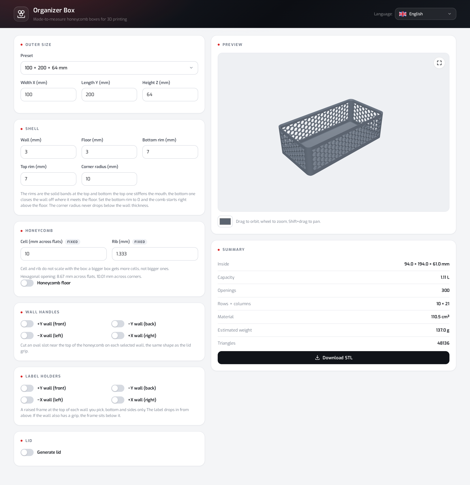
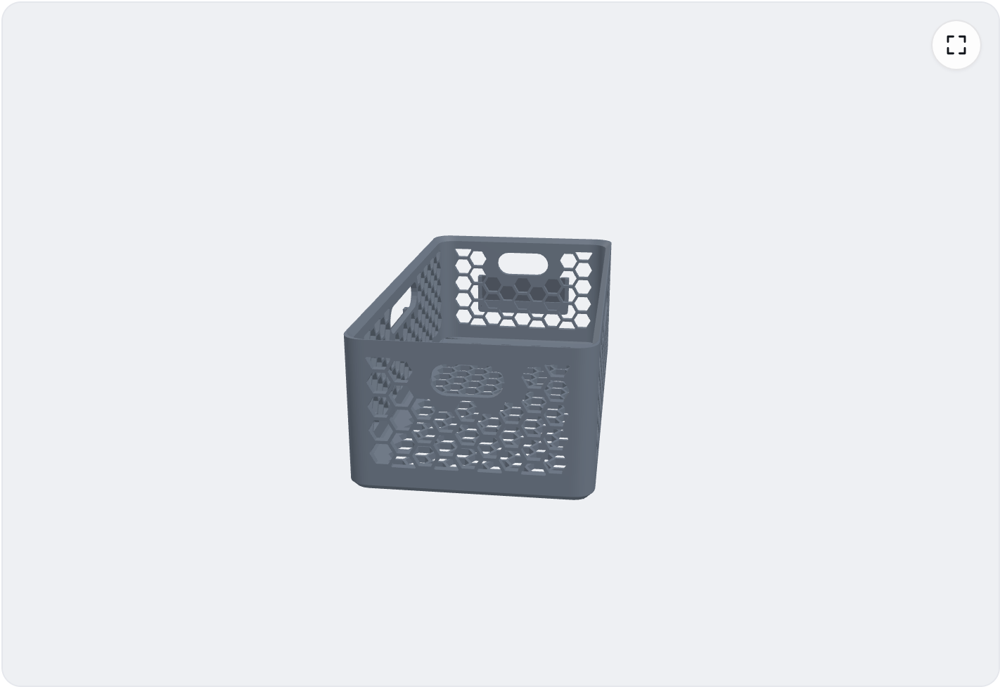
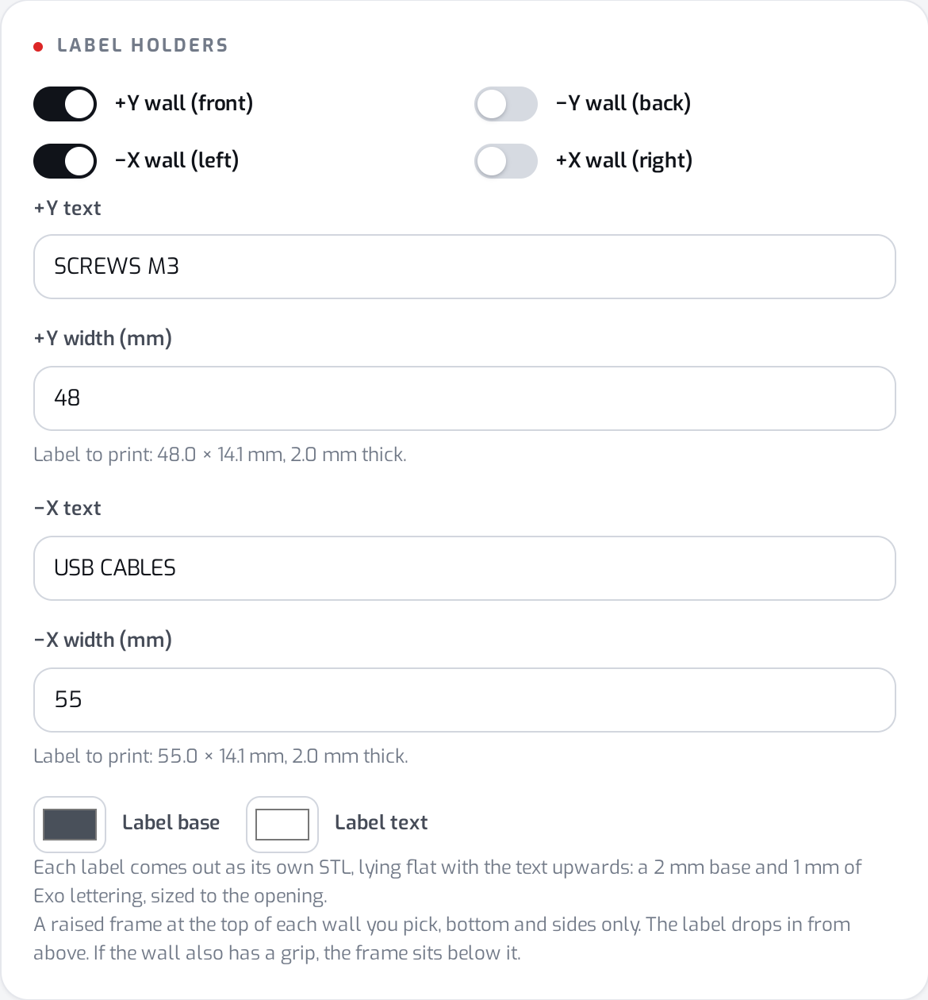
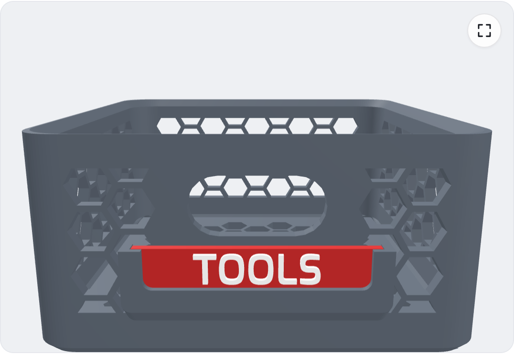
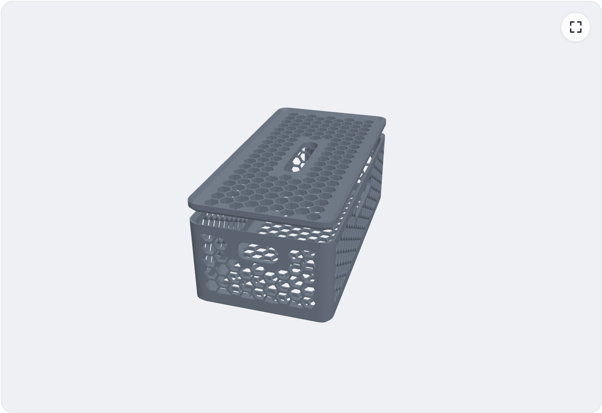
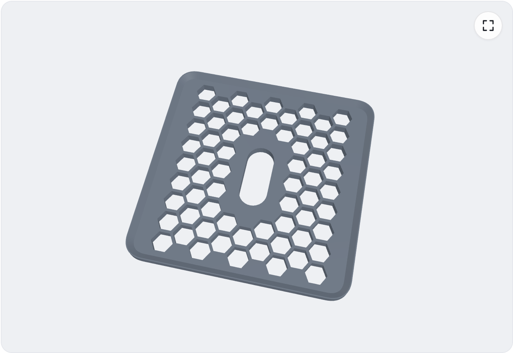

# Organizer Box

A single-page browser app that generates made-to-measure **honeycomb organizer boxes** for FDM 3D printing. Open `index.html`, set the dimensions, toggle the features you want, and download watertight binary STLs — no build step, no server, no OpenSCAD.



## What you get

| Piece | File | Notes |
|---|---|---|
| Box | `box-{X}x{Y}x{Z}-c{cell}-n{rib}.stl` | Squircle corners, solid rims, honeycomb walls |
| Lid | `…-lid.stl` | Same stacking interlock as the boxes |
| Label | `…-label-y+.stl` (etc.) | One file per wall, flat, text up |

One piece downloads as a plain STL. Two or more travel together in a ZIP (browsers block a page that tries to fire several downloads in a row). Every mesh is closed, millimetre-scaled, and ready for the slicer.

Languages: English (default), Portuguese, Spanish, French, German, Italian, Simplified Chinese, Japanese.

## Quick start

1. Open [`index.html`](index.html) in a modern browser (Chrome, Firefox, Safari, Edge). A double-click is enough — no local server required.
2. Pick a preset or type outer size, wall, floor and rim thicknesses.
3. Optionally enable a honeycomb floor, wall handles, label holders (with text, width and colours) and a lid.
4. Orbit the 3D preview (drag to orbit, wheel to zoom, Shift+drag to pan).
5. Hit **Download STL** / **Download ZIP**.

CDN dependencies (loaded when the page opens): React 18, three.js 0.147, earcut, opentype.js, and the Exo SemiBold font for embossed label text.

## Defaults

| Parameter | Default | Range (clamped) |
|---|---|---|
| Outer size (X × Y × Z) | 100 × 200 × 64 mm | 24–500 × 24–500 × 10–400 |
| Wall | 3 mm | 1 … short-side / 5 |
| Floor | 3 mm | 0.8 … Z / 3 |
| Bottom rim | 7 mm | 0 … remaining band |
| Top rim | 7 mm | 1.5 … Z / 2 |
| Corner radius | 10 mm | ≥ wall … short/2 − wall − 0.5 |
| Cell (across flats) | 10 mm | **fixed** — does not scale with the box |
| Rib | 1.333 mm | **fixed** |
| Lid plate | 4 mm | ≥ rim chamfer + 1 mm |
| Lid clearance | 0.3 mm per side | 0 … ~1.5 mm |

Presets: `100×200×64`, `100×100×64`, `200×200×64`, `150×150×40`, `80×160×100`.

A larger box gets **more** honeycomb cells of the same size, not bigger cells. That is intentional: ribs stay printable on a 0.4 mm nozzle and openings stay finger-friendly.

## Features

### Honeycomb walls (always on)

The perforated band sits between the solid bottom and top rims. Openings are regular hexagons on a triangular lattice; clipped cells are kept only when at least 30 % of the opening survives. Walls are built by sweeping a cross-section along a superellipse outline (exponent 2.4), so corners stay smooth and the openings keep a constant size in the unrolled wall plane.

### Honeycomb floor

Toggle **Honeycomb floor** to punch the same lattice through the base. The floor stays a single closed shell (caps + walls around every opening).

### Wall handles



Per-wall checkboxes (`+Y` front, `−Y` back, `−X` left, `+X` right) cut a **stadium** (capsule) slot near the top of the honeycomb — the same shape and width as the lid finger slot. Width is shared: `clamp(min(X, Y) × 0.13, 11, 26)` mm, then capped by the perforated band so at least 2 mm of material remains above and below.

### Label holders



A three-sided raised frame on the outer skin of each wall you pick: bottom sill + left and right rails, open at the top so a card drops in from above.

| Detail | Value |
|---|---|
| Pocket depth | 2.4 mm (for a 2 mm printed card) |
| Grip on sill and both rails | 2.5 mm each |
| Print support | Sill underside is a 45° chamfer — no supports |
| Bottom corners | Same radius on the opening, the outer outline, and the card (capped by the 2 mm post) |
| Top edge | Square — that is how you insert and pull the card |

A wall may carry **both** a handle and a label holder. When it does, the frame sits 2 mm below the deepest point of the handle opening. If the box is too short for both, the UI names the walls that do not fit instead of silently dropping the frame.

### Printed labels



Each enabled holder opens a text field. What you type becomes a separate plate:

- **2 mm** base + **1 mm** raised lettering in **Exo SemiBold**
- Text scales to fill the visible window of the frame
- Per-wall **width** under the text field (empty = fit the wall; out-of-range values clamp)
- **Base colour** defaults to 20 % darker than the box colour
- **Text colour** defaults to black or white by Rec. 709 contrast against the base
- Colours are preview-only — STL has no colour channels
- Below ~4 mm body height the app warns that strokes will print thinner than one bead

The plate is exported lying flat with the text facing up, which is how it must be printed. Filament swap at the 2 mm layer if you want two-colour lettering.

### Lid





The lid is a solid part that reuses the box stacking geometry:

- **Underside** — the same chamfered foot a stacked box would carry
- **Top** — the same mouth recess, so another box can stack on a closed lid
- **Clearance** — how far the foot is taken in, per side (default 0.3 mm)
- Optional **finger slot** and/or **honeycomb** through the plate, in any combination

The preview toggle switches between **Box**, **Lid** and **Both**. The download button follows that selection.

## Download behaviour

| Preview shows | Button | Result |
|---|---|---|
| Box only | Download STL | `box-….stl` |
| Lid only | Download lid STL | `box-…-lid.stl` |
| Several pieces | Download ZIP (N STLs) | `box-….zip` containing each STL |

File names are always English (`box`, `lid`, `label-y+`, `label-x-`, …).

## Printing

- Print the **box and lid** flat on the bed, no supports. The base and rim chamfers are 45°.
- Default **1.333 mm ribs** come out as 3–4 perimeters on a 0.4 mm nozzle. If your slicer leaves them hollow, lower extrusion width or raise the rib in the app.
- Print **labels** flat, text up, no supports. Swap filament at 2 mm for contrasting lettering.
- Estimated weight in the summary assumes ~1.24 g/cm³ (typical PETG/PLA density). Treat it as a guide.

## How the geometry is built

Everything lives in `index.html` as a self-contained **BoxEngine**:

1. **Outline** — superellipse (squircle) corners sampled by arc length, then paired with an inward offset for the cavity.
2. **Wall sweep** — a solid cross-section walked along the outline; honeycomb openings are subtracted in the unrolled *(arc length, height)* plane so cell size stays constant as the box grows.
3. **Floor / lid faces** — triangulated with earcut, including holes for honeycomb and the lid grip.
4. **Label holders** — one continuous watertight shell swept with a varying profile (sill → return → post), so corners never Z-fight.
5. **Label text** — opentype.js glyph outlines → winding-based hole classification → earcut → extrude; walls are derived from triangulation edges so caps and sides stay manifold even when earcut bridges counters.
6. **Export** — binary STL (80-byte header + facet count + 50 bytes/triangle). Multi-file downloads wrap entries in a stored (uncompressed) ZIP.

The 3D preview and the downloaded files share the same triangle soup, so what you see is what you slice.

## Repository layout

```
organizer-box/
├── index.html              # UI, i18n, geometry engine, STL/ZIP export
├── README.md
├── .gitignore
└── docs/
    └── screenshots/        # Playwright captures used above
```

## Screenshots

| | |
|---|---|
| Full UI |  |
| Feature-rich box |  |
| Box + lid |  |
| Lid alone |  |
| Label UI |  |
| Label on the wall |  |

## License

Personal project. Use and remix freely for your own prints.
